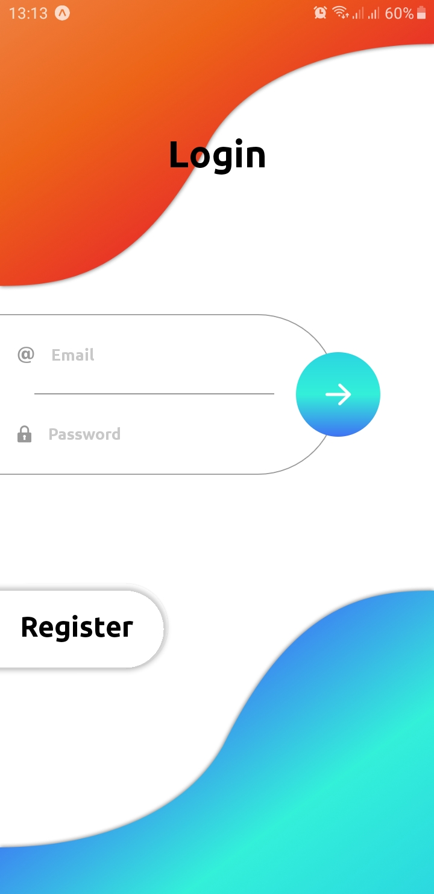
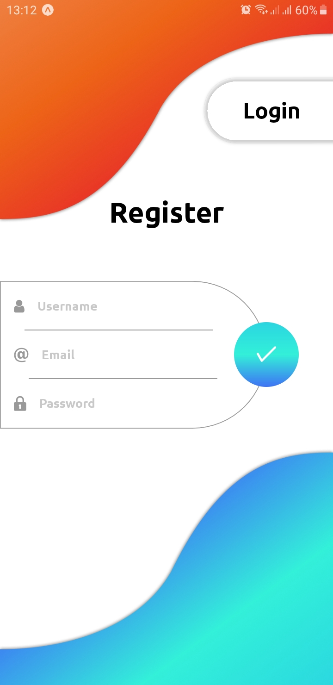

<h1 align="center"> :rocket: App-Authentication</h1>

<p align="center">
  
  
</p>

<p align="center">
  
  
  
  
  
</p>

<h3> :computer: Technologies used</h3>

<ul>
  <li>AdonisJs</li>
  <li>Expo</li>
  <li>React Hooks</li>
</ul>

<h3> :memo: How use</h3>

Clone this repo
```
  git clone https://github.com/leandro-wrf/app-authentication.git  
```
Install dependecies
```
  cd server && yarn
  cd app && yarn
```

Install adonisjs in your machine
```
  sudo npm install -g adonis
```

Run migrations and start app
```
  cd server && adonis migration:run
  adonis serve --dev
```

Install expo in you machine
```
  sudo npm install -g expo-cli
```

Run app mobile
```
  cd app && expo start
```

<h3>License</h3>
<p>
  License MIT.
</p>